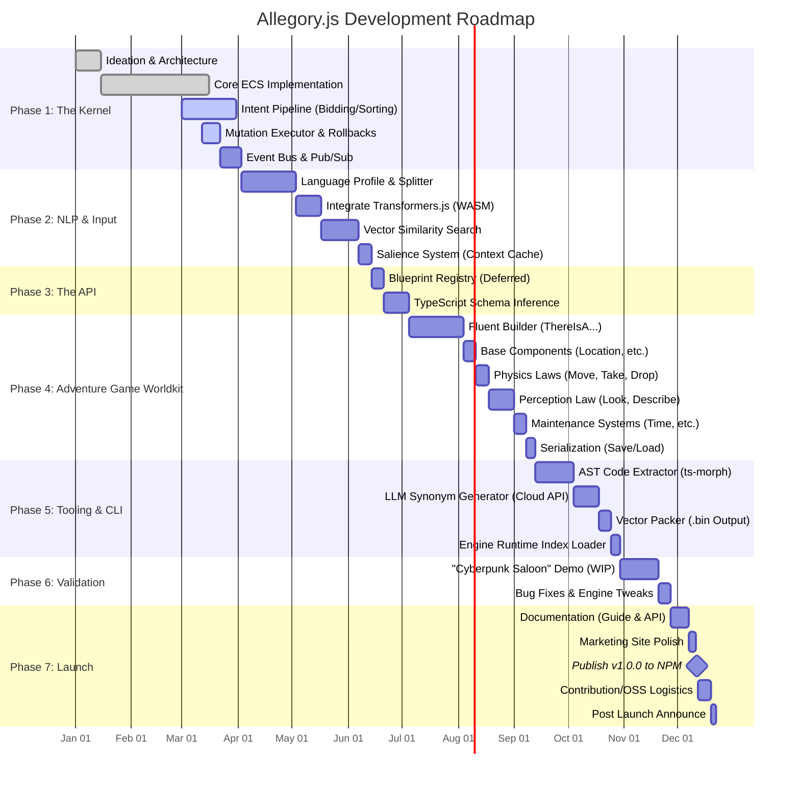

# Allegory.js

<picture>
  <source media="(prefers-color-scheme: dark)" srcset="./images/allegory_logo_horizontal_light.png">
  <source media="(prefers-color-scheme: light)" srcset="./images/allegory_logo_horizontal.png">
  
</picture>

> **Status: Pre-Alpha / Heavy Development**
> *This repository is currently a construction zone. Architecture is being defined, and the kernel is being built.*

**Allegory.js** is a modern, web-native engine for simulation-based Interactive Fiction.

It aims to bridge the gap between traditional parser games (Inform 7, TADS) and systemic game design, bringing deep world simulation to the JavaScript ecosystem.

## The Vision

*   **Simulation, Not Trees:** The world state is managed by an ECS (Entity-Component-System) database, not a branching narrative tree. Objects have physics, weight, logic, and independent agency.
*   **Natural Language:** Built from the ground up to support modern NLP. The engine understands *Intent* ("Bowl the ball") rather than just strict syntax (`USE BALL ON LANE`).
*   **Web Native:** Games are built in standard TypeScript/JavaScript. They run in any browser, work on mobile, and can be styled with standard CSS.
*   **Fluent API:** Define your world using a human-readable chained syntax:
    ```javascript
    ThereIsAContainer('old_chest')
        .withDescription('A rotted wooden chest.')
        .is('locked')
        .containing('rusty_key');
    ```

## Architecture

AllegoryJS is built on a reactive, event-driven pipeline:
1.  **Input:** User text is routed via Semantic Embeddings to determine Intent.
2.  **Logic:** "Laws" (Middleware) bid on intents based on specificity.
3.  **Data:** A flat, relational ECS database manages the state.
4.  **Reaction:** World events trigger emergent behaviors in NPCs and systems.

See [TDD.md](./docs/TDD.md) for a technical deep dive.

## Roadmap



## Contributing

We are currently building the foundation. If you are interested in the architecture of text engines, feel free to watch the repo or open a discussion.

## A Note on AI

AllegoryJS uses AI to empower the player, not to replace the author.

- Understanding, Not Hallucinating: We use local AI models to parse user input (Natural Language Processing). This allows the player to type freely without guessing the exact verb syntax.

- Human-Crafted Stories: The engine is designed for hand-written narratives and rigorous logic. The AI determines what the player wants to do, but the game logic determines what happens next.

- Deterministic Simulation: Unlike LLM-generated games, AllegoryJS simulations are stable, debuggable, and handcrafted by the developer.

- Local Models First: The ML pipeline is run entirely inside of the player's browser; this allows for fully offline play, and is significantly faster and less wasteful than having the client rely on talking to a big LLM over the wire.

*License: MIT*
